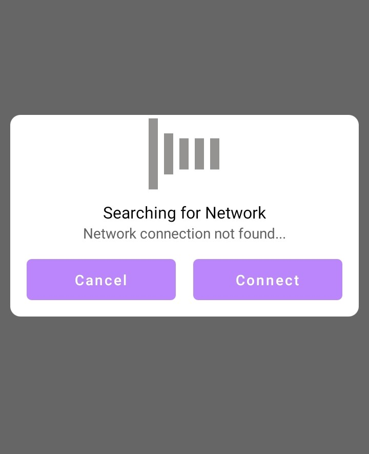

# NetworkDetector
**_Detect active network connection when launching your app_**
>Step 1. Add the JitPack repository to your build file
```gradle
allprojects {
		repositories {
			...
			maven { url 'https://jitpack.io' }
		}
	}
  ```
  >Step 2. Add the dependency
  ```gradle
  dependencies {
	        implementation 'com.github.techseya:NetworkDetector:Tag'
	}
  ```
  ### Usage 
 
  >Popup window with buttons
  ```java
  NetworkDetector.Detector(this,"Searching for Network","Network connection not found...");
  ```
  >Progress dialog with animation
  ```java
  NetworkDetector.ProgressDetector(this,MainActivity.this,"Searching for network","Network connection not found...");
  ```
 
  
  
